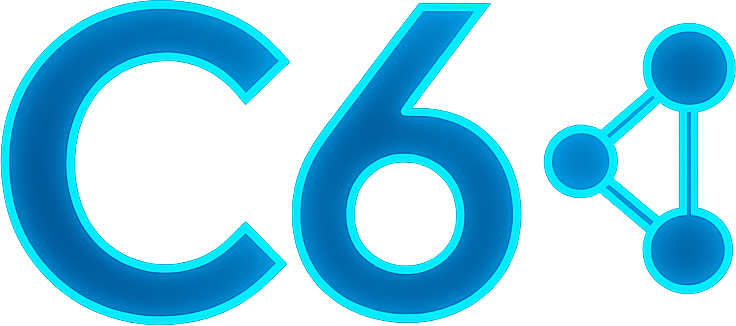

  

# Cyberphysical System Integrations & Interoperability Communications Security (C6)  
**Version 2.0 – Full Update**  
Author: Michael "Mike" Curnow  
Date: September 2025  

---

## Executive Summary

Critical infrastructure depends on cyber-physical systems (CPS): integrated technologies that sense, compute, control, and connect the physical and digital worlds. Historically, cybersecurity has focused on the CIA triad of confidentiality, integrity, and availability - a model optimized for data protection.  

But CPS is different. The real-world risk is not stolen data, but physical harm caused by manipulated or disrupted communications. That is why C6 adopts the SAIC tetrad: Safety, Availability, Integrity, and Confidentiality.  

C6 is a discipline, a framework, and a movement:  

- **Discipline:** It defines a field of study within cybersecurity, focused on conduits that interconnect CPS.  
- **Framework:** It offers practical methodologies and profiles for securing conduits, aligned with international standards.  
- **Movement:** It advocates for a safety-first mindset in industry, policy, and culture - reminding us that *securing conduits is securing lives.*  

C6 does not claim that conduits are the only attack surface. Instead, it emphasizes that attention to conduits is underdeveloped yet essential. By questioning trust models, analyzing risks through SAIC, and designing resilient conduits, C6 seeks to prevent cascading failures that threaten both critical infrastructure and civil freedoms.  

---

## 1. Definitions & Scope  

- **Cyber-Physical System (CPS):** An engineered system that tightly integrates sensing, computation, networking, and actuation to monitor and control processes in the physical world. CPSs combine digital logic with physical dynamics - for example, industrial control systems, autonomous vehicles, smart grids, medical devices, and connected transportation networks. A CPS typically includes:  
	- Sensors that collect measurements from the physical environment.  
	- Controllers and computation units that process data and make decisions.  
	- Networking components that transmit information and commands.  
	- Actuators that produce physical actions in response.  
  In the C6 model, CPSs are the **systems of systems** whose safe operation depends not only on endpoint resilience but on the **trustworthiness of the conduits** that connect their components. Traditional IT security focuses on protecting data; CPS security extends this to protecting **human life, infrastructure, and the environment.**
- **Conduit:** A channel that facilitates the transfer of data, commands, or signals between zones or nodes. Conduits may take the form of physical links (e.g., fiber, RF, serial), logical constructs (e.g., VPNs, VLANs, APNs), broadcast channels (e.g., LTE SIBs, GPS), or cross-domain bridges (e.g., IT/OT gateways, cloud APIs). In IEC 62443 and CENELEC TS 50701, conduits are defined primarily as the controlled communication paths between security zones. C6 extends this definition by:  
	- Treating conduits as first-class security objects requiring independent risk assessment.  
	- Applying the SAIC tetrad to every conduit, prioritizing safety alongside availability, integrity, and confidentiality.  
	- Recognizing conduits as both technical constructs (links, protocols, broadcasts) and trust relationships (who is allowed to communicate, under what assumptions).  
  In short: zones define the endpoints, but conduits define the pathways, and in C6, those pathways are the focus of protection,
- **SAIC Tetrad:**  
	- Safety: Preventing harm to people, environment, and critical assets.  
	- Availability: Ensuring reliable, uninterrupted service.  
	- Integrity: Guaranteeing trustworthy, unaltered data and signals.  
	- Confidentiality: Protecting against unauthorized access to sensitive data.  
	- **Zone:** A grouping of assets that share a common security level, trust boundary, or functional role within a CPS. Zones are used to segment systems so that security controls can be applied consistently inside the zone, while communication between zones is controlled through conduits. Based on IEC 62443, zones can represent anything from a control room network, to a safety-critical subsystem, to a cloud service boundary. In C6, zones provide the endpoints`**
C6 scope: securing conduits of communication between CPS components.  

---

## 2. Purpose  

C6 began as an exploration of cross-sector CPS risks (C6 v1.0, 2022). Since then, global advances in hyper-connectivity, AI, Industry 5.0, and PQC have expanded both opportunities and risks.  

C6 v1.1 evolves into a conduit-centric model. It is designed for adoption by researchers, engineers, operators, and policymakers. Its purpose is to:  
- Guide research into threats and mitigations.  
- Provide a structured framework for applying SAIC to conduits.  
- Inspire a movement that places safety at the center of cybersecurity.  

---

## 3. Mission  

*“To architect, engineer, and promote methodologies, best practices, and specifications that secure conduits between cyber-physical systems, ensuring their trustworthiness, resilience, and safety for civilzation.”*  

---

## 4. Compass & Principles  

C6 is guided by these principles:  

1. **Question implicit trust.** No conduit should be considered safe by default.  
2. **Safety first.** SAIC > CIA - human life takes precedence over secrecy.  
3. **Preserve autonomy.** Security mechanisms must not embed surveillance or backdoors.  
4. **Resilience and future-proofing.** Conduits must withstand disruption, evolve with PQC, and integrate with AI/ML safely.  
5. **Cross-sector relevance.** C6 applies regardless of domain: energy, transportation, water, healthcare, or manufacturing, etc  

---

## 5. Conduit Taxonomy  

C6 identifies four classes of conduits. These classes describe the **nature of how information flows between systems** rather than the sectors that use them. Every conduit type must be analyzed through the SAIC tetrad.  

Classification is not meant to be rigid or mutually exclusive - many real-world conduits blend characteristics. Instead, the taxonomy provides a structured way to analyze risks, prioritize defenses, and guide the design of C6 Conduit Security Profiles (CSPs).  

---

### 5.1 Physical Conduits  

**Definition:**  
Physical conduits are the tangible media and link technologies that carry signals between systems. They are concerned with the actual wires, fibers, and radio waves over which communication occurs.  

**Classification Criteria:**  
- Defined by the *medium* (cable, fiber, spectrum).  
- Failure caused by physical disruption or signal interference.  
- Attacks often involve tampering, jamming, or tapping.  

**Examples:** Ethernet cables, industrial serial buses (RS-232/485), radio frequency channels, optical fiber, microwave backhaul.  

**SAIC Emphasis:** Availability is the most critical pillar, followed by integrity.  

**SAIC analysis:**  
- **Safety:** Malicious commands over Modbus could trigger unsafe states.  
- **Availability:** Jamming RF or cutting fiber disrupts processes.  
- **Integrity:** Lack of replay protection exposes PLCs.  
- **Confidentiality:** Unencrypted traffic leaks operations data.  

**Security Objectives:**  
- Ensure redundant links and failover paths.  
- Deploy anti-jamming and interference detection.  
- Apply encryption/tamper detection even on “air-gapped” links.  

---

### 5.2 Logical Conduits  

**Definition:**  
Logical conduits are abstracted communication pathways created through software, protocols, or configuration. They do not depend on a single physical medium but on how systems partition, route, or encapsulate traffic.  

**Classification Criteria:**  
- Defined by *protocol or configuration*, not by the physical medium.  
- Can span multiple physical links transparently.  
- Security relies heavily on crypto and protocol design.  

**Examples:** VPN tunnels, VLAN segments, MPLS label-switched paths, cellular APNs, 5G network slices.  

**SAIC Emphasis:** Integrity and confidentiality dominate, as trust in logical encapsulation depends on strong crypto and key management.  

**SAIC analysis:**  
- **Safety:** Misrouted VPN traffic could disrupt railway signals.  
- **Availability:** VPN endpoints can be DDoS’d.  
- **Integrity:** Weak key exchange exposes injection risk.  
- **Confidentiality:** Poor crypto reveals sensitive data.  

**Security Objectives:**  
- Enforce strong and modern cryptography.  
- Rotate keys and validate session setup.  
- Monitor tunnels for unusual routing or encapsulation anomalies.  

---

### 5.3 Broadcast Conduits  

**Definition:**  
Broadcast conduits distribute information simultaneously to many receivers without pre-established trust relationships. These channels are typically open by design and thus highly susceptible to spoofing, injection, and denial. In CPS, broadcast conduits often carry safety-critical timing, control, or status data.  

**Classification Criteria:**  
- One-to-many communication by design.  
- No guaranteed prior trust between sender and receivers.  
- Receivers often assume broadcasts are legitimate.  

**Examples:** GPS/GNSS signals, Wi-Fi beacons, LTE/5G system information blocks (SIBs), paging channels, radio telemetry.  

**SAIC Emphasis:** Safety and integrity are the most at risk, because false broadcasts can cause cascading physical failures.  

**SAIC analysis:**  
- **Safety:** Rogue SIB messages could misdirect UEs, causing unsafe routing in C-V2X systems.  
- **Availability:** Malicious base stations can trap UEs in a camped state, denying service.  
- **Integrity:** Rogue LTE cells send false SIBs.  
- **Confidentiality:** Wi-Fi probes leak user identity.  

**Security Objectives:**  
- Authenticate broadcast sources where possible.  
- Deploy anomaly detection and cross-check with redundant signals.  
- Harden UE behavior against rogue broadcast abuse.  

---

### 5.4 Cross-Domain Conduits  

**Definition:**  
Cross-domain conduits link systems that belong to different trust zones, security domains, or organizational boundaries. They are the points where IT meets OT, or where industrial equipment connects to cloud services. These conduits are often the most critical, and the most fragile, because they bridge fundamentally different architectures and assumptions.  

**Classification Criteria:**  
- Connects two or more *different trust zones*.  
- Often crosses IT/OT, private/public, or enterprise/third-party boundaries.  
- Failure or compromise can propagate across domains.  

**Examples:** IT/OT gateways, cloud APIs for industrial telemetry, C-V2X sidelink between vehicles, IIoT overlay networks.  

**SAIC Emphasis:** Safety and confidentiality dominate, since cross-domain breaches can both cause unsafe operations and leak sensitive data.  

**SAIC analysis:**  
- **Safety:** Cloud-issued bad commands crash industrial processes.  
- **Availability:** API failures halt IoT services.  
- **Integrity:** Replay of CAN bus frames manipulates vehicles.  
- **Confidentiality:** Weak API auth exposes sensitive telemetry.  

**Security Objectives:**  
- Harden gateways and enforce strict identity/authentication.  
- Apply network segmentation between zones.  
- Audit cross-domain policies and monitor traffic rigorously.  

---

### 5.5 Overlaps and Hybrids  

In practice, conduits often blend characteristics:  
- A **5G network slice** (logical) carried over **fiber backhaul** (physical) that distributes **SIB broadcasts** (broadcast).  
- A **cloud API** (cross-domain) tunneled via a **VPN** (logical).  

C6 allows conduits to be categorized under multiple classes. The purpose is not exclusivity but to identify which **SAIC risks dominate** in each case.  

---

### 5.6 Summary Table  

| Conduit Class   | Definition | Key Examples | SAIC Priority | Security Objectives |  
|-----------------|------------|--------------|---------------|---------------------|  
| **Physical**    | Tangible media and links | Ethernet, RF, fiber | Availability | Redundancy, anti-jam, tamper detection |  
| **Logical**     | Software/protocol-defined paths | VPN, VLAN, APN, 5G slice | Integrity / Confidentiality | Strong crypto, key mgmt, monitoring |  
| **Broadcast**   | One-to-many open channels | GPS, Wi-Fi beacons, LTE SIBs | Safety / Integrity | Auth, anomaly detection, UE hardening |  
| **Cross-Domain**| Bridges across trust zones | IT/OT gateways, APIs, CV2X | Safety / Confidentiality | Harden gateways, segmentation, monitoring |  

---

## 6. Threats to Conduits  

Conduits are subject to a wide range of threats. While some overlap with traditional IT risks, their **impact in CPS is amplified by the SAIC model** - as failures can compromise human safety and critical services.  

### 6.1 Downgrade Attacks  
**Definition:** Forcing a system to fall back to a weaker or legacy protocol, cipher, or mode of operation.  
- **Conduit Classes Impacted:** Logical, Broadcast, Cross-Domain.  
- **Examples:**  
	- Mobile devices coerced into 2G fallback, exposing them to null ciphering.  
	- Wi-Fi WPA3 clients tricked into WPA2 negotiation.  
- **SAIC Impact:**  
	- **Safety:** Manipulated fallbacks could allow rogue commands to critical devices.  
	- **Availability:** Forced fallbacks may reduce throughput, causing unsafe latency in ITS.  
	- **Integrity/Confidentiality:** Weak ciphers enable injection and surveillance.  

---

### 6.2 Rogue Conduits  
**Definition:** Malicious or unauthorized conduits impersonating legitimate infrastructure.  
- **Conduit Classes Impacted:** Broadcast, Cross-Domain.  
- **Examples:**  
  - IMSI catchers presenting as base stations.  
  - Fake Wi-Fi APs harvesting IoT telemetry.  
  - BGP route hijacks misdirecting traffic.  
- **SAIC Impact:**  
  - **Safety:** False broadcasts in CV2X could trigger braking or collisions.  
  - **Availability:** Denial of service by trapping devices to rogue cells.  
  - **Integrity:** Attackers inject manipulated parameters.  
  - **Confidentiality:** IMSIs, location, and traffic captured.  

---

### 6.3 Data Manipulation  
**Definition:** Altering conduit traffic in transit - including injection, replay, or latency manipulation.  
- **Conduit Classes Impacted:** All (physical, logical, broadcast, cross-domain).  
- **Examples:**  
  - Replay of CAN bus frames in vehicles.  
  - Injection of false SCADA telemetry.  
  - Time-shifted V2X packets causing collisions.  
- **SAIC Impact:**  
  - **Safety:** False control signals trigger dangerous operations.  
  - **Availability:** Queuing delays lead to missed deadlines in safety systems.  
  - **Integrity:** Replay undermines trust in signals.  
  - **Confidentiality:** Not primary, but may leak when traffic is altered.  

---

### 6.4 Surveillance Misuse  
**Definition:** Abuse of conduits for covert monitoring, either by states, corporations, or insiders.  
- **Conduit Classes Impacted:** Logical, Broadcast, Cross-Domain.  
- **Examples:**  
  - Lawful intercept backdoors in telecom equipment exploited by adversaries.  
  - Persistent metadata harvesting from IoT devices.  
- **SAIC Impact:**  
  - **Safety:** Surveillance may enable targeting of critical assets.  
  - **Availability:** Monitoring tools can degrade performance.  
  - **Integrity:** Potential insertion of malicious payloads under cover of “lawful intercept.”  
  - **Confidentiality:** Direct loss of privacy and industrial secrecy.  

---

### 6.5 Supply Chain Risks  
**Definition:** Compromise introduced during design, manufacturing, or deployment of conduit components.  
- **Conduit Classes Impacted:** Primarily Physical and Cross-Domain, but extends to all.  
- **Examples:**  
  - Hardware implants in routers or basebands.  
  - Malicious firmware updates in IIoT gateways.  
  - Exploits hidden in open-source libraries used in VPNs.  
- **SAIC Impact:**  
  - **Safety:** Backdoored conduit components can issue unsafe commands.  
  - **Availability:** “Kill switch” implants can disrupt critical infrastructure.  
  - **Integrity:** Firmware trojans manipulate data silently.  
  - **Confidentiality:** Exfiltration of sensitive telemetry or keys.  

---

### 6.6 Emerging Threats  
**Definition:** New risks driven by evolving technology and adversary capabilities.  
- **AI-Driven Attacks:** Machine learning used to discover anomalies in protocol negotiation or fuzz conduits at scale.  
- **6G & Beyond:** New spectrum and slicing mechanisms may open unforeseen conduit vulnerabilities.  
- **Quantum Threats:** Once quantum computers mature, current cryptography securing logical conduits may collapse.  

---

### 6.7 Threat-to-Conduit Matrix  

| Threat              | Physical | Logical | Broadcast | Cross-Domain | Example                    |     |
| ------------------- | -------- | ------- | --------- | ------------ | -------------------------- | --- |
| Downgrade Attack    | ❌        | ✅       | ✅         | ✅            | 2G fallback                |     |
| Rogue Conduit       | ❌        | ❌       | ✅         | ✅            | IMSI catcher               |     |
| Data Manipulation   | ✅        | ✅       | ✅         | ✅            | CAN replay                 |     |
| Surveillance Misuse | ❌        | ✅       | ✅         | ✅            | Lawful intercept abuse     |     |
| Supply Chain Risk   | ✅        | ✅       | ✅         | ✅            | Backdoored router          |     |
| Emerging Threats    | (All)    | (All)   | (All)     | (All)        | PQC break, AI fuzzing, etc |     |
|                     |          |         |           |              |                            |     |
|                     |          |         |           |              |                            |     |

---

## 7. C6 Methodology  

The C6 methodology provides a structured process for evaluating and securing conduits using the SAIC tetrad. It is designed to be practical for engineers, researchers, and policymakers, while remaining flexible enough to adapt to evolving technologies.  

---

### 7.1 Step 1: Identify Conduits  
**Goal:** Create a complete map of communication flows within and across CPS.  
- Document every channel: wired links, wireless links, broadcast signals, VPNs, APIs, gateways, etc.  
- Capture *who communicates with whom*, *over what medium*, and *with what dependencies*.  
- Tools/Approaches:  
	- Network discovery tools (Nmap, Wireshark, passive monitoring).  
	- CPS diagrams and data flow maps.  
	- Asset management systems.  

---

### 7.2 Step 2: Classify  
**Goal:** Categorize each conduit under one or more C6 classes (physical, logical, broadcast, cross-domain).  
- Apply the classification criteria (Section 5).  
- Acknowledge overlaps: a conduit may span multiple classes.  
- Record classification explicitly in conduit inventory.  
- Tools/Approaches:  
	- Architecture reviews.  
	- Protocol analysis.  
	- Standards mapping (IEC 62443, TS 50701).  

---

### 7.3 Step 3: Apply SAIC  
**Goal:** Assess each conduit against Safety, Availability, Integrity, and Confidentiality.  
- **Safety:** What harm could arise if this conduit fails or is manipulated?  
- **Availability:** What processes depend on its continuous uptime?  
- **Integrity:** How is authenticity and correctness assured?  
- **Confidentiality:** Does the conduit expose sensitive data?  
- **Techniques**:  
	- Threat modeling (STRIDE adapted to SAIC).  
	- Attack tree analysis.  
	- Adversarial testing / red teaming.  

---

### 7.4 Step 4: Mitigate  
**Goal:** Apply layered defenses to reduce risk across SAIC dimensions.  
- Strategies:  
  - **Redundancy:** Use diverse paths and fallback mechanisms.  
  - **Cryptography:** Apply modern, PQC-ready crypto for logical conduits.  
  - **Authentication:** Authenticate broadcast and cross-domain messages where feasible.  
  - **Segmentation:** Isolate high-risk conduits from critical safety processes.  
  - **Detection:** Use anomaly detection, telemetry, and AI-driven baselining.  
- Tools/Approaches:  
  - Security gateways, anomaly detection systems, jamming detectors, integrity monitors.  

---

### 7.5 Step 5: Monitor  
**Goal:** Continuously validate conduit trustworthiness during operation.  
- Techniques:  
  - Real-time telemetry and integrity monitoring.  
  - Cross-validation of redundant broadcasts (e.g., GNSS + inertial nav).  
  - Continuous key management and crypto updates.  
- Outcomes:  
  - Early detection of rogue conduits.  
  - Faster response to anomalies.  
  - Evidence for compliance with C6 CSPs.  

---

### 7.6 C6 Conduit Security Profiles (CSPs)  

**Definition:** A CSP is a standardized profile for a given conduit type. It documents SAIC risks, known threats, required mitigations, and monitoring strategies.  

**CSP Structure:**  
1. **Conduit Type:** (e.g., LTE SIB broadcast, VPN tunnel).  
2. **Classification:** Physical, logical, broadcast, cross-domain.  
3. **SAIC Analysis:** Risk breakdown across safety, availability, integrity, confidentiality.  
4. **Threats:** Known attack patterns relevant to this conduit.  
5. **Mitigations:** Technical and operational countermeasures.  
6. **Monitoring:** How the conduit should be validated in practice.  
7. **Residual Risk:** What risks remain after mitigations.  

---

### 7.7 Worked Example: LTE Broadcast Channel (SIBs)  

1. **Conduit Type:** LTE System Information Block (SIB).  
2. **Classification:** Broadcast conduit.  
3. **SAIC Analysis:**  
   - Safety: Rogue SIBs can misdirect ITS systems.  
   - Availability: Rogue cell can trap devices and deny service.  
   - Integrity: Null cipher allows fake broadcasts.  
   - Confidentiality: IMSI leaks enable tracking.  
4. **Threats:** IMSI catchers, null cipher, rogue base stations.  
5. **Mitigations:**  
   - Apply CSIV (Cell Selection Integrity Verification).  
   - Enforce broadcast authentication where supported.  
   - UE heuristics to detect rogue cells.  
6. **Monitoring:**  
   - Continuous scan for rogue SIBs.  
   - Anomaly detection on cell parameters.  
7. **Residual Risk:** Legacy UEs without CSIV remain vulnerable.  

---

### 7.8 Methodology Lifecycle  

The methodology is iterative:  
- New conduits may be introduced over time.  
- Threats evolve (e.g., AI/ML-driven fuzzing, quantum risks).  
- CSPs must be updated continuously.  

C6 positions conduit security as a living practice, not a one-time assessment.  

---

## 8. Standards Integration  

C6 complements and extends existing frameworks:  
- **IEC 62443:** Zones and conduits.  
- **CENELEC TS 50701:** Railway comms safety.  
- **NIST CSF 2.0 & Zero-Trust Architecture (2024):** Applied to CPS conduits.  
- **3GPP Rel-16/17/18:** CV2X, network slicing.  
- **PQC (NIST 2022–24):** Preparing conduits for quantum threats.  
- **Industry 5.0:** Human-centric, resilient, sustainable CPS.  

---

## 9. Challenges & Buy-In  

While the C6 methodology is designed to be practical and adaptable, adoption faces significant challenges across technical, cultural, economic, and regulatory dimensions. Recognizing these obstacles is essential to driving realistic implementation and long-term sustainability.  

---

### 9.1 Technical Adoption  
- **Legacy Integration:** Many CPS rely on decades-old technologies (serial buses, 2G/3G modules, proprietary protocols) that were never designed with SAIC in mind. Retrofitting them without disrupting operations is difficult and expensive.  
- **Heterogeneity:** Systems often mix modern and legacy conduits. Protecting them requires bridging inconsistent security capabilities.  
- **Testing Limitations:** Real-world validation of conduit defenses (e.g., rogue base station detection) can be complex and risky in production environments.  
- **Resource Constraints:** IoT and embedded devices may not have the compute or power budgets for advanced crypto, PQC, or continuous monitoring.  

---

### 9.2 Cultural and Organizational Barriers  
- **Silos:** Executives, engineers, regulators, and operators often view security through different lenses, leading to gaps in shared understanding.  
- **Risk Perception:** CPS operators may undervalue conduit security because “it has always worked”, until a catastrophic failure occurs.  
- **Change Resistance:** Operational teams often prioritize uptime and safety, making them reluctant to alter communication flows, even if insecure.  
- **Skills Gap:** Few practitioners are trained to think in conduit-centric, SAIC-oriented terms.  

---

### 9.3 Economic and Incentive Challenges  
- **Cost of Retrofit:** Securing conduits often requires hardware replacement, protocol upgrades, or new monitoring systems, all of which incur significant expense.  
- **Misaligned Incentives:** Vendors may prioritize time-to-market over security-by-design. Operators may prefer short-term savings over long-term resilience.  
- **Invisible ROI:** Unlike endpoint breaches, conduit compromises may not be obvious until they cause safety incidents, making it harder to justify investment in prevention.  

---

### 9.4 Policy, Regulation, and Autonomy  
- **Surveillance Pressure:** Governments may demand lawful intercept or backdoor access to conduits, directly conflicting with C6’s principle of preserving autonomy.  
- **Fragmented Standards:** Different regions and sectors adopt IEC 62443, TS 50701, NIST CSF, or bespoke standards inconsistently. Harmonization is slow.  
- **Compliance vs. Security:** Organizations may focus on “checking the box” rather than genuinely adopting SAIC-based security.  
- **Civil Liberties:** If poorly implemented, conduit monitoring could morph into mass surveillance, eroding public trust.  

---

### 9.5 Scalability and Future-Proofing  
- **Hyper-Connectivity:** The number of conduits grows exponentially with IoT, IIoT, C-V2X, and Industry 5.0 integration. Manual approaches cannot scale.  
- **AI and Automation:** Defenses must evolve to leverage AI/ML for anomaly detection while resisting adversarial AI-driven attacks.  
- **Quantum Transition:** PQC adoption will be uneven, and conduits may remain exposed long after quantum threats materialize.  
- **Continuous Evolution:** Conduits change over time as systems are upgraded. Without continuous monitoring and CSP updates, protections decay.  

---

### 9.6 Path to Buy-In  
To overcome these challenges, C6 adoption requires:  
- **Demonstrating Safety Value:** Position conduit security as a public safety and liability issue, not just an IT concern.  
- **Cross-Sector Collaboration:** Build joint initiatives between operators, vendors, academia, and regulators.  
- **Economic Incentives:** Encourage investment through insurance discounts, safety certifications, or government grants.  
- **Awareness and Training:** Promote education on SAIC and conduit security across engineering, management, and policy circles.  

---

### 9.7 Challenges vs. Mitigations Matrix  

| Challenge Category              | Specific Challenge                                     | C6 Mitigation Pathway                                                                                                               |     |
| ------------------------------- | ------------------------------------------------------ | ----------------------------------------------------------------------------------------------------------------------------------- | --- |
| **Technical**                   | Legacy CPS cannot support modern crypto or monitoring. | Introduce gateway-based protections (external monitors, proxy encryption) instead of retrofitting endpoints.                    |     |
|                                 | Heterogeneous systems with inconsistent security.      | Use C6 CSPs to normalize expectations across conduit types, regardless of vendor or age.                                        |     |
|                                 | Limited resources in IoT/embedded devices.             | Apply lightweight SAIC checks (e.g., replay protection, anomaly heuristics) with higher-assurance checks offloaded to gateways. |     |
| **Cultural/Organizational**     | Silos between engineers, execs, regulators.            | Establish cross-disciplinary conduit risk workshops based on SAIC models.                                                       |     |
|                                 | Operators undervalue conduit risks.                    | Use incident case studies (Colonial, Oldsmar, GNSS spoofing) to highlight real-world safety impacts.                            |     |
|                                 | Resistance to change due to uptime concerns.           | Adopt staged deployment of CSPs that can run in passive/monitoring mode before enforcing.                                       |     |
| **Economic/Incentives**         | High cost of retrofits.                                | Promote incremental adoption: CSP templates allow phasing improvements by conduit priority.                                     |     |
|                                 | Vendors prioritize speed over security.                | Push CSP certification as a differentiator in the market (compliance + safety label).                                           |     |
|                                 | ROI on prevention is unclear.                          | Link conduit security to liability reduction and insurance incentives for operators.                                        |     |
| **Policy/Autonomy**             | Governments demanding backdoors.                       | Reaffirm C6's stance: safety-first, autonomy-preserving, recommend cryptographic transparency + public oversight.               |     |
|                                 | Fragmented standards landscape.                        | Position C6 as a bridge framework, mapping SAIC analysis onto IEC 62443, TS 50701, NIST CSF.                                    |     |
|                                 | Compliance-only adoption.                              | Encourage CSP-driven audits that go beyond checkbox compliance into real risk analysis.                                         |     |
| **Scalability/Future-Proofing** | Exponential conduit growth with IoT/IIoT.              | Leverage automation + AI-assisted CSP generation to scale SAIC analysis.                                                        |     |
|                                 | Quantum threats looming.                               | Prepare conduits with PQC-ready designs, phased in via CSP updates.                                                             |     |
|                                 | Continuous evolution of CPS.                           | Treat CSPs as living documents, updated with each lifecycle phase (design, deploy, maintain).                                   |     |

---

## 10. Conclusion & Call to Action  

C6 v1.1 evolves beyond its sectoral roots into a conduit-centric discipline, framework, and movement.  

- As a discipline: C6 formalizes conduit security as a field of study.  
- As a framework: C6 provides SAIC-driven methodologies and CSPs.  
- As a movement: C6 advocates for safety-first cybersecurity in industry, policy, and culture.  

> **Securing conduits is securing lives.**  

---

## Appendix A: Example C6 Conduit Security Profiles (CSPs)  

C6 Conduit Security Profiles (CSPs) provide reusable, structured templates for documenting the SAIC analysis, threat landscape, and mitigations associated with a specific type of conduit. Each CSP is intended to be sector-agnostic: whether in energy, transportation, healthcare, or manufacturing, the same profile can be adapted and applied.  

A CSP typically includes:  
1. **Conduit Type** – The specific communication channel under review.  
2. **Classification** – Physical, logical, broadcast, cross-domain (or hybrid).  
3. **SAIC Analysis** – Risk breakdown across safety, availability, integrity, confidentiality.  
4. **Threats** – Known attack vectors relevant to this conduit.  
5. **Mitigations** – Technical and operational countermeasures.  
6. **Monitoring** – How the conduit should be validated in practice.  
7. **Residual Risk** – Risks that remain even after mitigations.  

---

### CSP Example 1: LTE Broadcast Channel (System Information Blocks)  

**Conduit Type:** LTE System Information Block (SIB) broadcast  
**Classification:** Broadcast Conduit  

**SAIC Analysis:**  
- **Safety:** Rogue SIB causes unsafe routing in ITS, potential collisions.  
- **Availability:** Denial via rogue cell → service outage.  
- **Integrity:** Null cipher permits manipulated broadcasts.  
- **Confidentiality:** IMSI leakage enables subscriber tracking.  

**Threats:**  
- IMSI catchers (fake base stations).  
- Null cipher downgrade.  
- Rogue SIB injection.  

**Mitigations:**  
- Conduit-level integrity checks (CSIV).  
- Mandatory ciphering & broadcast authentication (where supported).  
- UE heuristics to detect rogue cells.  
- Continuous monitoring of broadcast anomalies.  

**Monitoring:**  
- Passive scanning for rogue cell parameters.  
- Anomaly detection on SIB content.  
- Crowd-sourced detection (shared reports from distributed UEs).  

**Residual Risk:**  
- Legacy UEs without CSIV remain vulnerable.  
- Regions where regulators still allow 2G fallback.  

---

### CSP Example 2: VPN Tunnel for IT/OT Gateway  

**Conduit Type:** VPN tunnel connecting an enterprise IT network to an OT control network  
**Classification:** Logical + Cross-Domain Conduit  

**SAIC Analysis:**  
- **Safety:** Compromise of the tunnel could allow malicious commands into OT systems.  
- **Availability:** DDoS on VPN endpoint can halt OT connectivity.  
- **Integrity:** Weak key exchange or session hijacking could allow injection of false telemetry.  
- **Confidentiality:** Poor cipher suites may leak sensitive OT process data.  

**Threats:**  
- Exploitation of outdated VPN protocols (e.g., PPTP, IKEv1).  
- Credential theft or weak authentication.  
- Endpoint compromise (malware on IT side).  
- Side-channel leakage (traffic analysis, metadata exposure).  

**Mitigations:**  
- Enforce strong modern crypto (AES-256, ChaCha20, PQC-ready key exchange).  
- Multi-factor authentication for VPN access.  
- Segmentation of IT and OT zones behind the VPN gateway.  
- Rate limiting and DDoS protection at endpoints.  
- Regular patching and certificate rotation.  

**Monitoring:**  
- Continuous log review of VPN sessions.  
- Alerts for anomalous connection times, volumes, or origins.  
- Endpoint integrity checks before allowing access.  

**Residual Risk:**  
- Insider threats with valid credentials.  
- Zero-day exploits against VPN software.  
- Dependence on VPN availability (single point of failure if not redundant).  

---

## Changelog  

| Date           | Version | Focus / Theme                     | Major Changes                                                                                                                                                                                                                                                                                                                                                                                           | Notes                                                                                                                                   |
| -------------- | ------- | --------------------------------- | ------------------------------------------------------------------------------------------------------------------------------------------------------------------------------------------------------------------------------------------------------------------------------------------------------------------------------------------------------------------------------------------------------- | --------------------------------------------------------------------------------------------------------------------------------------- |
| April 2022     | v1.0    | Sector-Focused Foundations        | - Introduced C6 as a cross-sector concept (transportation, water, ICS, etc.) - Framed risks primarily by industry verticals. - Early emphasis on awareness and CPS integration.**                                                                                                                                                                                                                 | First public draft. Served as a conceptual entry point, but lacked a unified trust model or methodology.                                |
| September 2025 | v2.0    | Conduit-Centric & SAIC-Integrated | - Reframed taxonomy around conduits (physical, logical, broadcast, cross-domain). - Adopted SAIC tetrad (Safety, Availability, Integrity, Confidentiality) as guiding model. - Introduced C6 Methodology (identify. classify, apply SAIC, mitigate, monitor). - Defined C6 Conduit Security Profiles (CSPs) as practical templates. - Positioned C6 as discipline, framework, and movement. | Major revision, marked transition from awareness paper to a structured framework. Version bumped to 2.0 to reflect foundational change. |

